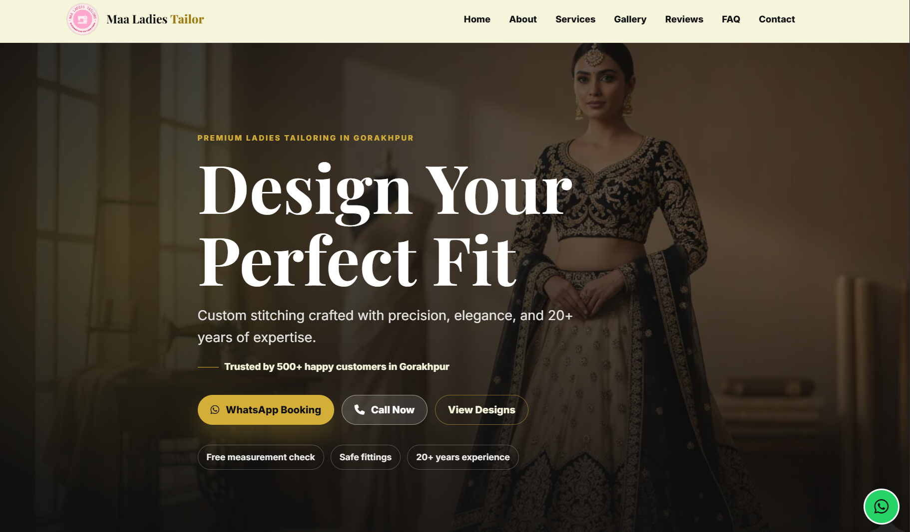
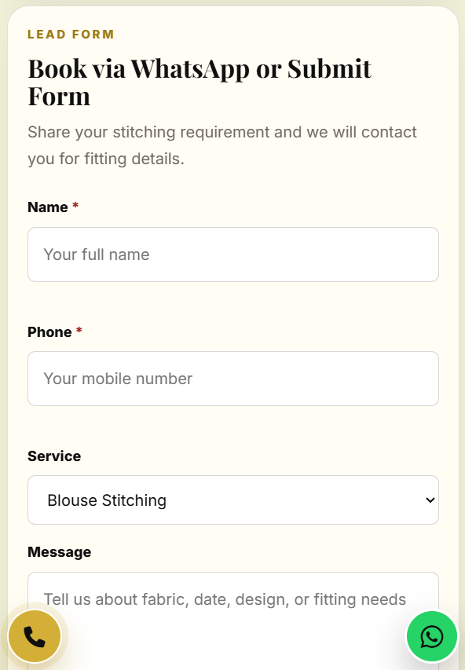

<p align="center">
  
</p>

<h1 align="center">
Maa Ladies Tailor Boutique Website
</h1>

<p align="center">
Professional Boutique & Tailoring Website
</p># Maa Ladies Tailor Boutique Website

Professional boutique and tailoring website developed for **Maa Ladies Tailor**, designed to establish a modern digital presence and improve customer engagement.

> Real client project delivered in 2025 and refined with updates in April 2026.

---

## Live Website

🌐 **Website:** https://maaladiestailor.in

---

## Project Overview

This project was developed as a professional boutique and tailoring website for **Maa Ladies Tailor**.

The goal of the website is to provide an elegant, responsive, and user-friendly platform where customers can explore tailoring services, view offerings, and contact the business easily.

The project combines modern frontend design with practical business functionality including contact integration and Google Sheets form handling.

---

## Project Status

✅ Completed and Delivered (2025)  
✅ Updated and Refined (April 2026)

---

## Features

- Responsive modern design
- Elegant boutique-themed interface
- Homepage and business introduction
- About section
- Services section
- Pricing and service information
- Image gallery
- Contact form
- Google Sheets form integration
- WhatsApp integration
- Call button support
- Google Maps integration
- Testimonials section
- Social media integration
- Mobile-friendly experience
- Smooth user navigation
- Business-focused UI/UX

---

## Tech Stack

### Frontend
- HTML5
- CSS3
- JavaScript

### Form Integration
- Google Apps Script
- Google Sheets Integration

### Hosting & Deployment
- Netlify Hosting
- Custom Domain Configuration

---

## Design Philosophy

The website follows an **elegant and modern boutique design language** focused on:

- Clean layout
- Mobile responsiveness
- User accessibility
- Fashion-oriented visual presentation
- Business credibility and trust

The interface was designed to reflect the boutique's identity while maintaining performance and usability.

---

## Screenshots

### Homepage


### Contact Section


### Mobile View

---

## Local Setup

Clone the repository:

```bash
git clone https://github.com/nikhil-mca-code/gws-maaladies-tailor.git
```

Open project folder:

```bash
cd gws-maaladies-tailor
```

Run locally by opening:

```text
index.html
```

in your browser.

---

## Project Structure

```text
gws-maaladies-tailor
├── photo/
├── LICENSE
├── README.md
├── ads.txt
├── blouseData.json
├── googlefb214505ef873c8f.html
├── index.html
├── script.js
├── styles.css
├── robots.txt
└── sitemap.xml
```

---

## Development Timeline

| Stage | Timeline |
|--------|----------|
| Initial Development | 2025 |
| Client Delivery | 2025 |
| Refinement & Updates | April 2026 |

---

## Credits

**Developed by Nikhil Singh**  
Founder & Developer — **Gorakhpur Web Studio**

Gorakhpur Web Studio focuses on student-driven web solutions, digital presence, and modern website development.

---

## License

This project is licensed under the **MIT License**.

---

## Repository Purpose

This repository serves as:

- A real client project showcase
- A professional portfolio project
- A demonstration of frontend and business website development

---

⭐ If you found this project useful or inspiring, consider giving the repository a star.